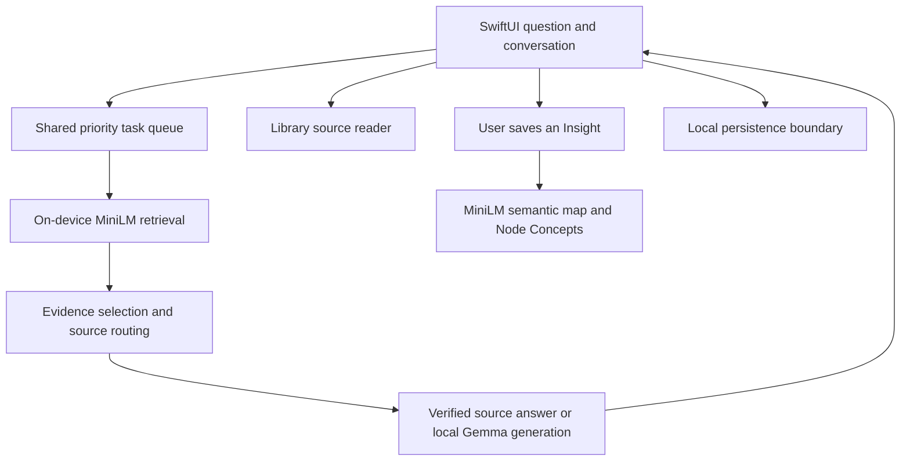

# Angrove: building an AI study product on an iPhone

**Role:** Ryan Baltodano, solo builder across product design, SwiftUI implementation, local model
integration, retrieval, persistence and evaluation. **Status:** active development; no public
release yet. [Website](https://angrove.app/) · [Product guide](https://angrove.app/guide.html)

## The problem and product hypothesis

A chat transcript is easy to create and difficult to build understanding around. Angrove's
hypothesis is that a private workspace combining conversation, inspectable primary sources and
saved concepts can help someone stay with serious questions about philosophy, theology and
history. It is a product hypothesis, not a demonstrated learning-outcome claim.

The core interaction is question → answer → contextual definition → saved Insight → semantic
map. Users choose which definitions become durable Insights; automatic analysis can suggest a
broader Node Concept, but it does not silently save an Insight for them. The Library lets a user
open source text rather than treat generated prose as an authority.

## Constraints that shaped the architecture

The app must run without a model server, preserve personal inquiry locally, and share a phone's
limited memory and thermal budget. The current development model is stock instruction-tuned
**Gemma 4 E4B (LiteRT Community)**, not an Angrove fine-tune. The current Library export contains
37 works and 51,836 passages; large artifacts are excluded from the repository.

The diagram is the logical answer flow. Other queued actions—definitions, naming and tree
labels—share the same process-scoped LiteRT runtime. A lifecycle manager controls loading,
unloading, background transitions and cancellation. Keeping one engine avoids competing model
instances and unsafe native teardown; explicit failure states avoid fabricated fallback answers.

## Decisions and tradeoffs

**Local retrieval rather than a hosted vector database.** A Core ML MiniLM encoder creates
384-dimensional vectors. A memory-mapped passage matrix supports a vectorized cosine scan.
Source routing and passage locators complement semantic ranking: similarity can match the city
of Nicaea in classical history when the user means the council. Tests assert the relevant source
text reaches the prompt. Similarity is a ranking signal, not a probability of truth.

**Evidence before fluent generation.** Some supported factual and primary-source requests can
return a verified grounded answer without another generation. Others use retrieved passages to
support the local model; scope guards can abstain when reliable evidence is absent. This improves
inspectability but limits coverage and can produce an unhelpful refusal. Broader retrieval is
not automatically better if it supplies irrelevant evidence.

**A task system around the model.** Conversation answers, definitions, tree updates and labels
share a queue. User-visible tasks can be cancelled or reordered. Persisted conversation and
branch identifiers keep a completed answer attached to its original question after navigation.
This turns runtime constraints into product behavior rather than leaving them as hidden failures.

**Measure the cost of thinking.** Four simulator CPU runs compared native thinking on and off.
Both arms totaled 74/80 objective passes across two previously used 40-case sets. Conventional
median answer times increased from 23.0 to 43.7 seconds on one set and 23.5 to 47.6 on the other.
That supported leaving thinking off by default. These are pattern-scored development comparisons,
not independent accuracy or phone-speed claims. See [methodology and hashed evidence](Evaluation.md).

**Fully Encrypted saved personal data.** The development encryption implementation uses
AES-256-GCM and Keychain-managed keys for personal stores, with a separate widget key. Startup
validates ciphertext before migrating plaintext. Deliberate JSON exports remain readable;
display, screenshots and Apple-managed backup protection are separate boundaries. Encryption
source integration and physical-device lock/backup restoration are still pending release work.
See [coverage and recovery](Data-Encryption.md).

## Evidence and what remains open

The repo contains behavior tests for lifecycle ownership, retrieval, source locators, late-result
persistence, semantic membership and encrypted-storage migration. The published evaluation
summary preserves the exact experiment build and hashes; it does not claim today's source has
been re-evaluated. Historical phone scores whose raw runs were lost are omitted from the public
headline results.

There is no published adoption, retention or learning-outcome evidence yet. The next product
validation is whether people actually revisit saved Insights, check source passages and find the
map useful. The next engineering gates are sustained phone memory/thermal/lifecycle performance,
model delivery, encryption migration and backup recovery, and a supported-device matrix.

## What to inspect

- [The app experience and screenshots](../README.md#a-look-inside)
- [Build requirements and missing development assets](Development-Setup.md)
- [`AngroveApplicationRuntime`](../Angrove-iOS/Services/AngroveApplicationRuntime.swift): model and queue ownership
- [`MiniLMGroundingProvider`](../Angrove-iOS/Services/MiniLMGroundingProvider.swift): evidence retrieval
- [`ModelTaskQueue`](../Angrove-iOS/Features/Conversation/ModelTaskQueue.swift): scheduling and cancellation
- [Evaluation report](Evaluation.md): measured decision and limitations

A longer walkthrough video will be added by the maintainer. The existing Study clip shows one
feature; it is not a full product demonstration.
