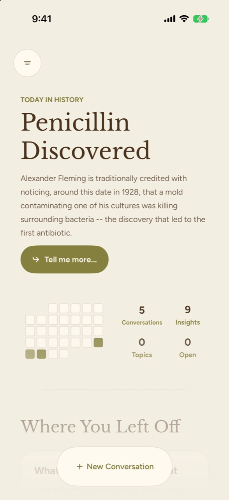
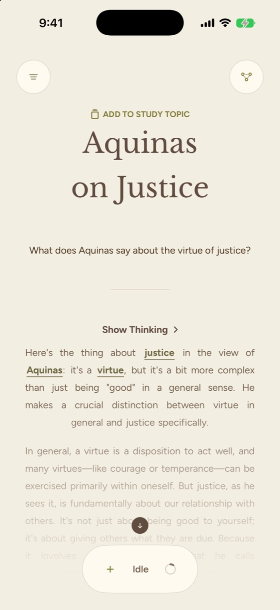
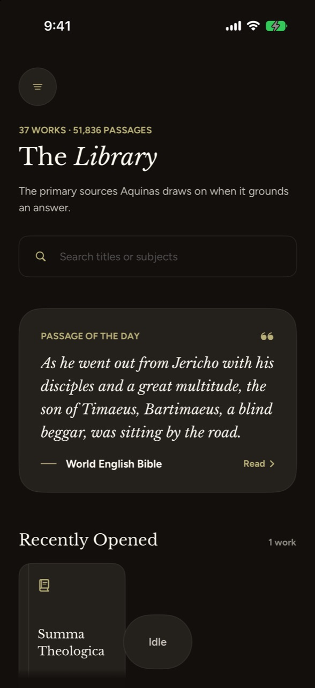
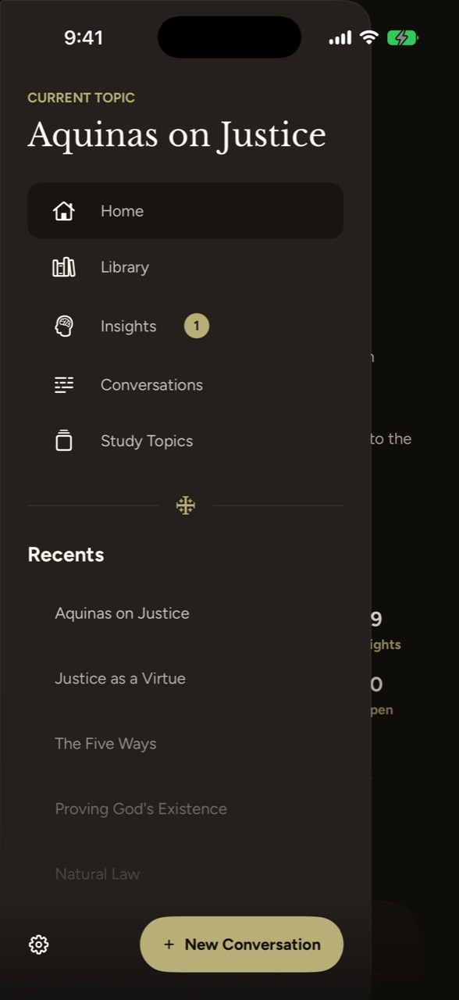

<p align="center">
  
  
  
  
  
</p>
<p align="center">
  
  
  
  
  <a href="Documentation/Screenshots/study-3d-demo.mp4"></a>
</p>

The top row is light mode and the bottom row is dark mode. From left to right: the Home dashboard,
a source-oriented conversation with contextual Insights, the Library of primary sources, the side
menu, and the Insight Tree and Study mode (which shows a Node Concept and its Insights in 3D;
select it for a short [demo video](Documentation/Screenshots/study-3d-demo.mp4)).

## A note on privacy and current development

Aquinas is a local-first project, not a hosted chat service. The iOS app is designed to use an
on-device language model and local source retrieval. It makes no network requests for model or
Insight Tree work.

This repository is an active development project. The local model and grounding assets are large
and intentionally excluded from source control, so a full on-device experience requires the
corresponding development assets.

## For contributors

The app is one part of a three-repository project. The backend repository holds offline tooling
for the grounding corpus, model conversion, and evaluation; the app does not call it at runtime.
The Foundations repository holds the shared product and architecture contracts.

| Repository | Role |
| --- | --- |
| [Aquinas Backend](https://github.com/rbaltodano/Aquinas_Backend) | Corpus tooling, model conversion, and evaluation. Its FastAPI service is no longer used by the app. |
| [Aquinas Foundations](https://github.com/rbaltodano/Aquinas-Foundations) | Shared product, design, model-integration, and Insight Tree documentation. |

Before contributing, read [`AGENTS.md`](AGENTS.md). It routes implementation work to the focused
architecture, runtime, workflow, and cross-repository documents without making the README carry
internal development detail.

## Repository guide

| Path | What you'll find |
| --- | --- |
| `Aquinas-iOS/App` | App entry point and overall navigation shell |
| `Aquinas-iOS/Features` | Conversation, Home, Insight Tree, Library, and settings experiences |
| `Aquinas-iOS/DesignSystem` | Typography, colors, and shared interface elements |
| `Aquinas-iOS/Services` | Model runtime and local grounding |
| `Aquinas-iOS/Persistence` | Local conversation and Insight state |
| `Aquinas-iOSTests` | Focused behavior and regression coverage |

## Open the project

Open `Aquinas-iOS.xcodeproj` in Xcode. The project targets iOS 26.4 and uses a concrete arm64
simulator destination when building from the command line:

```sh
xcodebuild -project Aquinas-iOS.xcodeproj -scheme Aquinas-iOS \
  -destination 'platform=iOS Simulator,name=iPhone 17' build
```

The README is intentionally public-facing. Detailed architecture, runtime constraints, and agent
guidance are routed from [`AGENTS.md`](AGENTS.md).

## Project status

Aquinas is in active development and is not yet a public consumer release. The
most useful parts of the project to explore today are the conversation flow,
source-grounded study experience, semantic Insight Tree, and on-device model
integration. The semantic layer is central to the product: it helps the app
show how ideas relate, cluster, and develop over time.

The repository does not include the full local model bundle. To run the complete
on-device experience, you will need the corresponding development model assets
and a recent Xcode installation.

## Related repositories

- [Aquinas Foundations](https://github.com/rbaltodano/Aquinas-Foundations) — product, design, and architecture contracts.
- [Aquinas Backend](https://github.com/rbaltodano/Aquinas_Backend) — offline corpus, conversion, and evaluation tooling.
