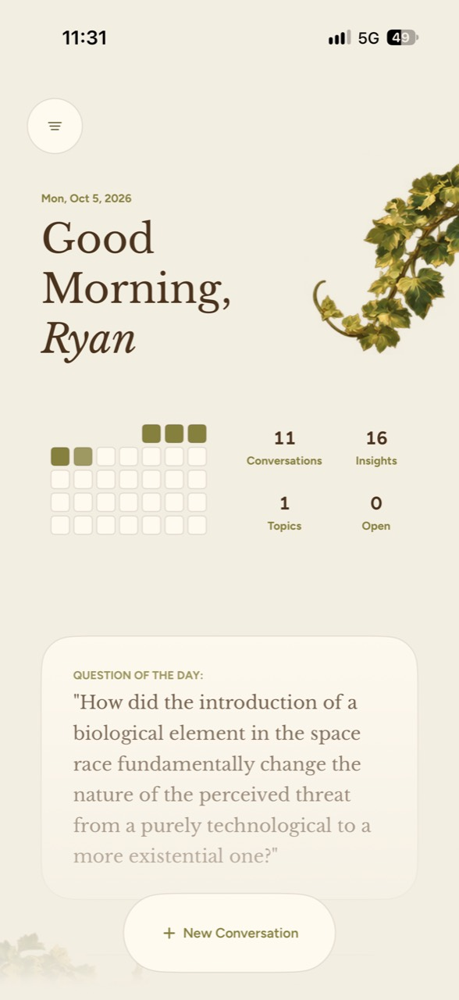
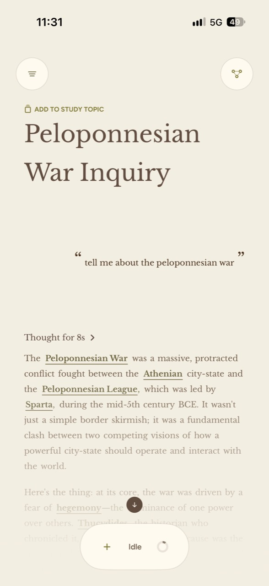
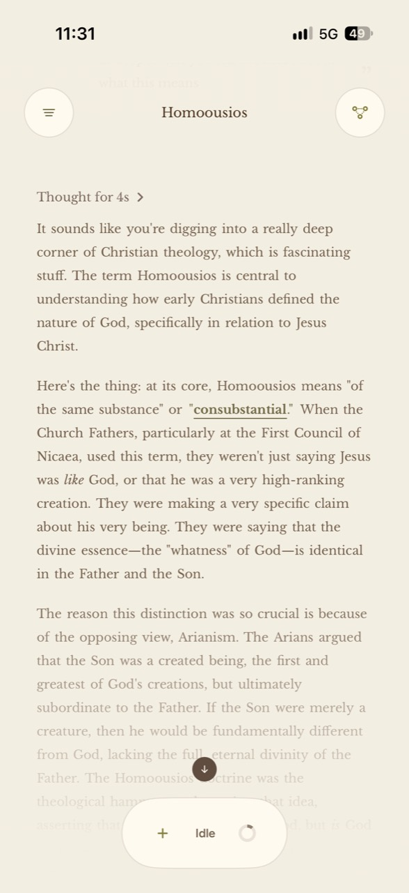
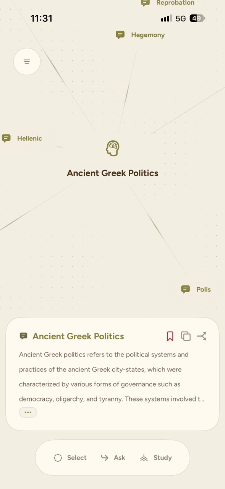
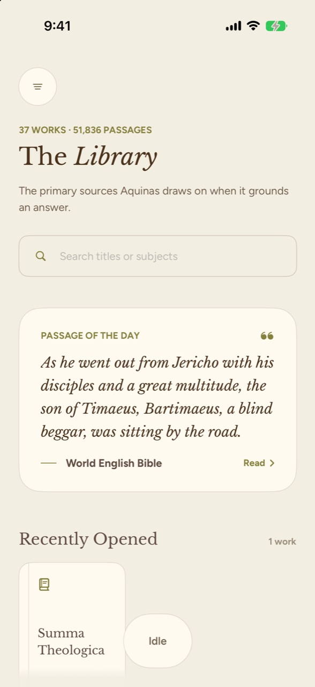
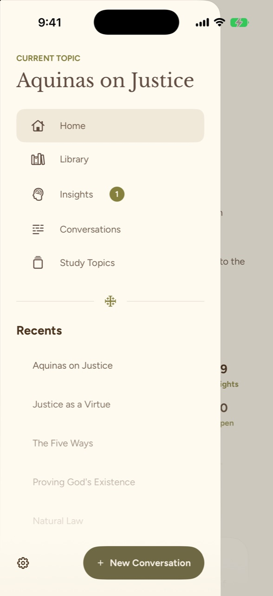
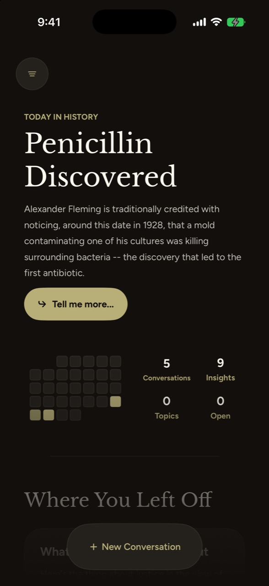
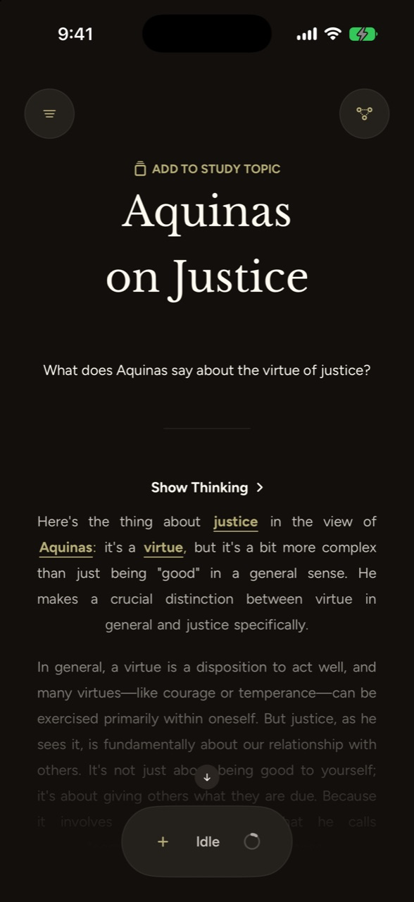

<p align="center">
  <picture>
    <source media="(prefers-color-scheme: dark)" srcset="Documentation/Brand/angrove-app-icon-dark.png">
    
  </picture>
</p>
<p align="center">
  <picture>
    <source media="(prefers-color-scheme: dark)" srcset="Documentation/Brand/angrove-logo-light-text.png">
    
  </picture>
</p>

# Angrove

**An AI of your own. A private place for serious questions.**

Angrove is a private, local-first companion for the rigorous study of philosophy, history, and
theology. Ask a question, test an argument, follow a contradiction, and keep the ideas worth
returning to. The app answers on your iPhone without sending your questions to a model server.

Built around understanding, Angrove brings conversation, primary sources, and a map of your own
thinking into one workspace. A discussion becomes something you can revisit and build on.

[Website](https://angrove.app/) · [User Guide](https://angrove.app/guide.html) ·
[FAQ](https://angrove.app/faq.html) · [Launch Status](https://angrove.app/waitlist.html) ·
[Case Study](https://angrove.app/case-study.html)

## Building the product around the model

This repository contains the iPhone app: SwiftUI interaction, a process-scoped LiteRT-LM runtime,
on-device retrieval, a shared model-task queue, durable conversations, and a semantic map of saved
ideas. Ryan Baltodano is the solo builder across product design and engineering.

| Start here | What it shows |
| --- | --- |
| [Technical case study](Documentation/Case-Study.md) | Product hypothesis, architecture decisions, tradeoffs and remaining validation |
| [Historical model exploration](Documentation/Model-Exploration.md) | Gemma 4 12B and Qwen3-4B experiments, runtime constraints and grounding lessons |
| [App Store release plan](Documentation/App-Store-Release-Plan.md) | Essential model delivery, owners, release gates and check-off schedule |
| [Release readiness audit](Documentation/Release-Readiness-Audit.md) | Local archive findings, implemented delivery foundation and remaining submission blockers |
| [Evaluation evidence](Documentation/Evaluation.md) | Four completed thinking-on/off comparisons, aggregate results and artifact hashes |
| [Build and setup](Documentation/Development-Setup.md) | Requirements, missing assets, exact model manifest and useful checks |
| [Architecture](Documentation/App-Architecture.md) | Runtime ownership, conversation identity and persistence boundaries |

**One measured decision:** native thinking remained off by default after two development sets
returned **74/80 objective passes in either arm**, while simulator median answer time roughly
doubled. These are historical pattern-scored comparisons, not an independent accuracy claim or
phone latency benchmark. See the report for the exact build and limitations.

## From a question to a map of your thinking

- **Conversation:** talk a question through, ask for an example or an objection, and follow up
  for as long as you need.
- **Insights:** tap an underlined term for a definition in the context of your discussion. Save
  the definitions worth keeping; saved definitions become Insights.
- **Insight Tree:** explore how your ideas connect. Angrove adds broader subjects called Node
  Concepts as a conversation develops; Insights are only added when you choose to save them.
  Semantic relatedness shapes the map, so distance reflects meaning rather than truth or importance.
- **Study and Midpoint:** explore a subject and its Insights in 3D, or select and weight ideas
  to propose a concept that connects them.
- **Library:** trace an answer to the passages it draws on and open the source to read it in
  context. The current bundled Library contains **37 works and 51,836 passages**, including
  Scripture, the Church Fathers, Thomas Aquinas, councils, catechisms, classical philosophy,
  and history. Retrieval runs on your phone.

Study Topics bring related conversations and their Insights together. Home offers a Question of
the Day and ideas worth revisiting, while Model Tasks lets you stop, remove, or reorder work
waiting for the on-device model.

## A look inside

October 5, 2026 app captures: Home, a Peloponnesian War inquiry, a Homoousios conversation,
and the Ancient Greek Politics map. Select an image to view it at full size.

<p align="center">
  <a href="Documentation/Screenshots/case-study-2026-10-05/home.jpg"></a>
  <a href="Documentation/Screenshots/case-study-2026-10-05/conversation-peloponnesian-war.jpg"></a>
  <a href="Documentation/Screenshots/case-study-2026-10-05/conversation-homoousios.jpg"></a>
  <a href="Documentation/Screenshots/case-study-2026-10-05/insight-map.jpg"></a>
</p>

[All seven new captures and their context](Documentation/Screenshots/case-study-2026-10-05/README.md)
include expanded source details and two mobile browser captures of the website's technical guide.

Earlier captures show the Library, menu, dark appearance, and Study mode:

<p align="center">
  
  
  
  
  <a href="Documentation/Screenshots/study-3d-demo.mp4"></a>
</p>

Select the Study image for the existing [short demo video](Documentation/Screenshots/study-3d-demo.mp4).

## A note on privacy and current development

Generation, source retrieval, and Insight Tree work run on-device. Conversations and saved
Insights stay in the app's local storage; answering questions and building the tree make no
network requests. Once the model is installed, Angrove works offline. No account is required.

**Fully Encrypted saved personal data — in development.** The local encryption implementation
uses AES-256-GCM,
including conversations, attachments, Insights, Study Topics, personal settings, and local
backups. Keys are protected by Apple Keychain. User-created conversation exports are readable
JSON. Source integration and physical-device lock/backup-restore validation are pending; this
is not a publicly released feature yet. See [encryption coverage and recovery](Documentation/Data-Encryption.md).

The current model is **Gemma 4 E4B, instruction-tuned, from the LiteRT Community package**,
running through Google's LiteRT-LM runtime. It is not an Angrove fine-tune. Angrove’s default
Scholarly personality uses the learned-friend prompt; its grounding comes from local retrieval.
A fine-tuned voice model is planned for a later release. On-device MiniLM embeddings support
source retrieval and the semantic relationships in the Insight Tree.

Answers can make mistakes. The Library makes it easy to check important claims against the
author's own words and context.

Angrove is in active development and is not publicly released yet. It is being built to stay
free, with no subscription or paywalled features. The app is built and tested on iPhone 17;
final supported-device requirements will be shared before launch.

The local model and grounding assets are large and intentionally excluded from source control.
A clean checkout can build the interface, but full inference requires the development artifacts.
[Setup instructions](Documentation/Development-Setup.md) explain the expected paths, model hash,
degraded behavior and release-delivery gap.

## For contributors

The app is one part of a three-repository project. The backend repository holds offline tooling
for the grounding corpus, model conversion, and evaluation; the app does not call it at runtime.
The Foundations repository holds the shared product and architecture contracts.

| Repository | Role |
| --- | --- |
| [Angrove Backend](https://github.com/rbaltodano/Angrove-Backend) | Corpus tooling, model conversion, and evaluation. Its FastAPI service is no longer used by the app. |
| [Angrove Foundations](https://github.com/rbaltodano/Angrove-Foundations) | Shared product, design, model-integration, and Insight Tree documentation. |

Before contributing, read [`AGENTS.md`](AGENTS.md). It routes implementation work to the focused
architecture, runtime, workflow, and cross-repository documents without making the README carry
internal development detail.

## Repository guide

| Path | What you'll find |
| --- | --- |
| `Angrove-iOS/App` | App entry point and overall navigation shell |
| `Angrove-iOS/Features` | Conversation, Home, Insight Tree, Library, and settings experiences |
| `Angrove-iOS/DesignSystem` | Typography, colors, and shared interface elements |
| `Angrove-iOS/Services` | Model runtime and local grounding |
| `Angrove-iOS/Persistence` | Local conversation and Insight state |
| `Angrove-iOSTests` | Focused behavior and regression coverage |

## Build and verify

Follow the [setup guide](Documentation/Development-Setup.md), then open
`Angrove-iOS.xcodeproj` with the **Angrove-iOS** scheme. The deployment target is iOS 26.4.
Use an installed concrete arm64 simulator:

```sh
xcodebuild -project Angrove-iOS.xcodeproj -scheme Angrove-iOS \
  -destination 'platform=iOS Simulator,name=iPhone 17' build
```

For deterministic checks and model-evaluation methodology, see [Evaluation](Documentation/Evaluation.md).
A full walkthrough video is still to be recorded; the [recording outline](Documentation/Demo-Outline.md)
is ready. Detailed contributor guidance starts at [`AGENTS.md`](AGENTS.md).
