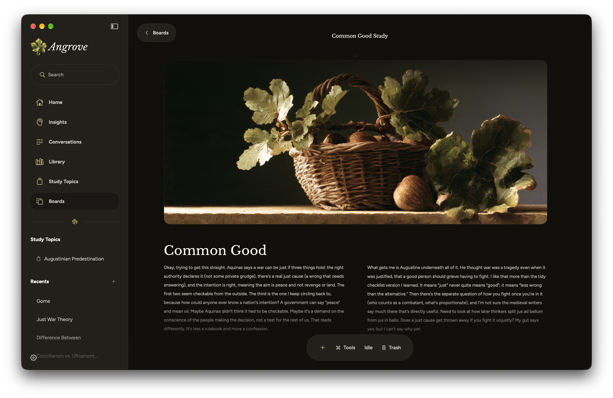
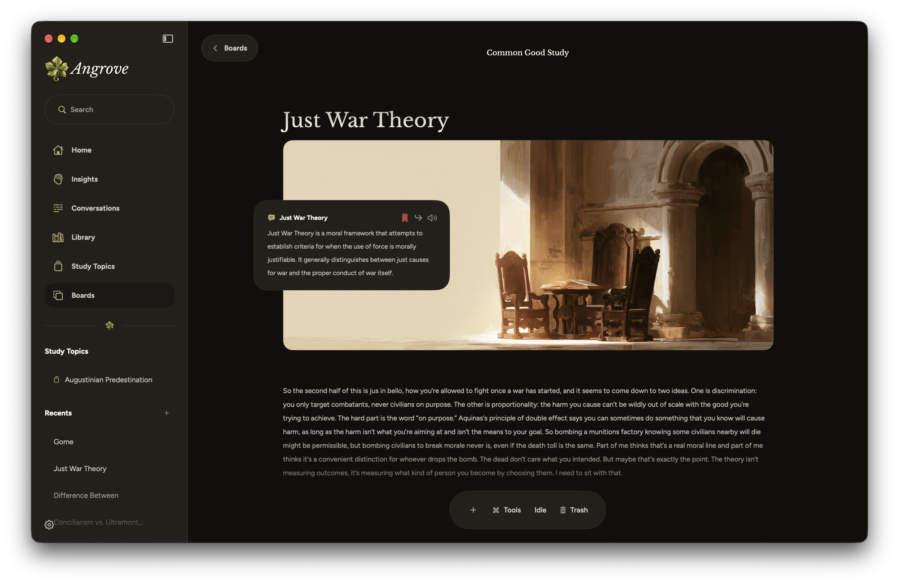
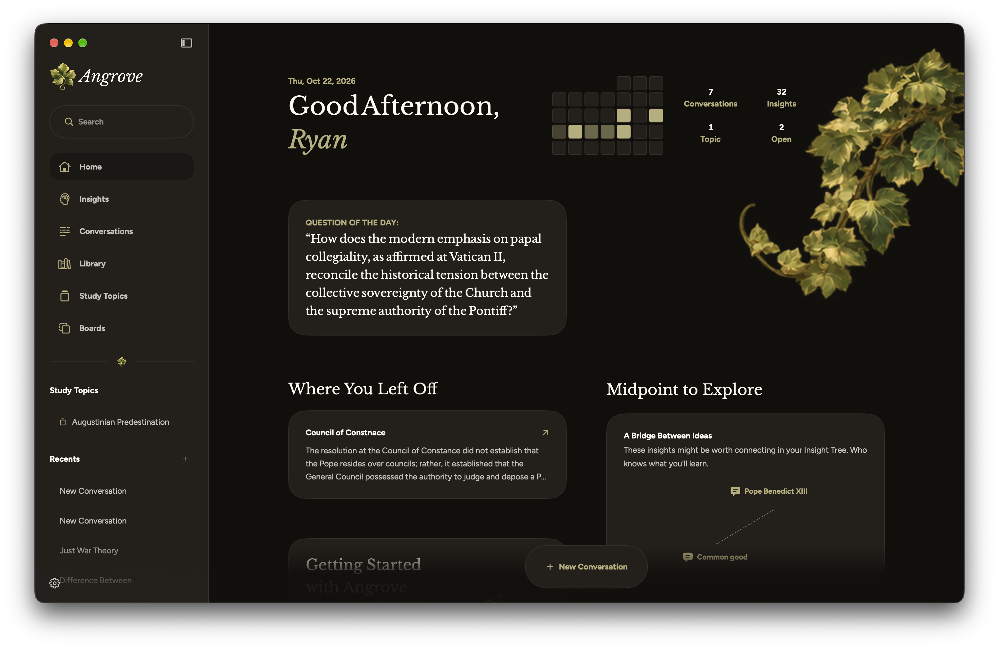
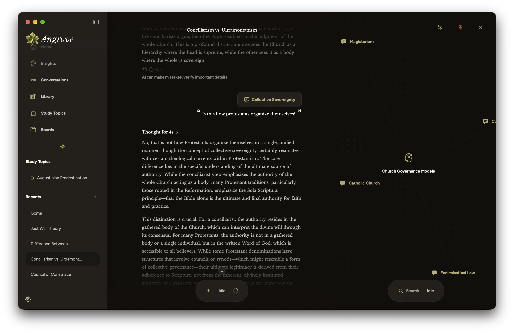
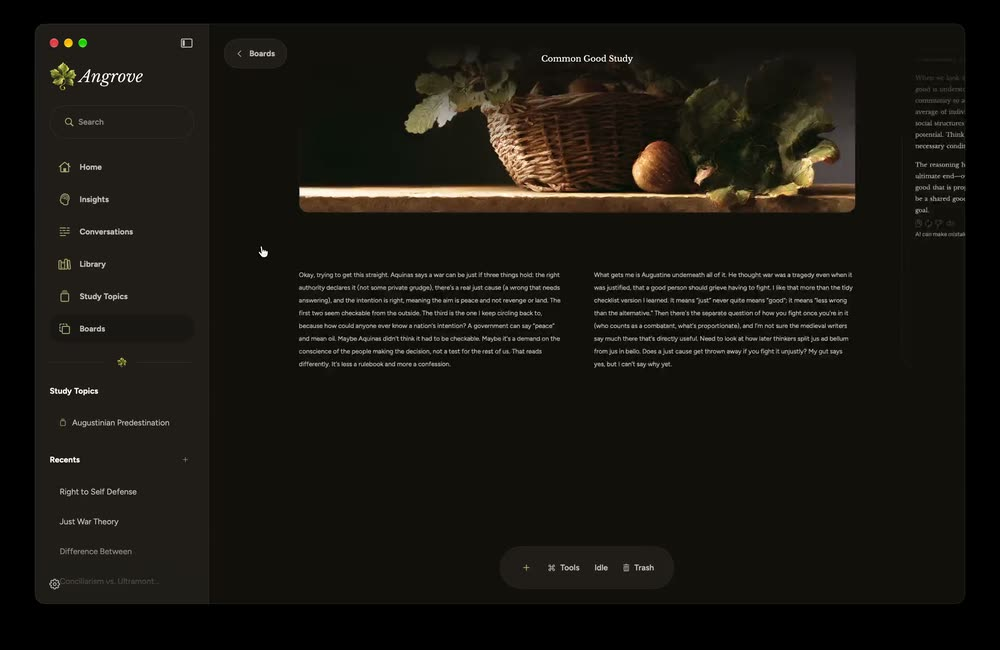
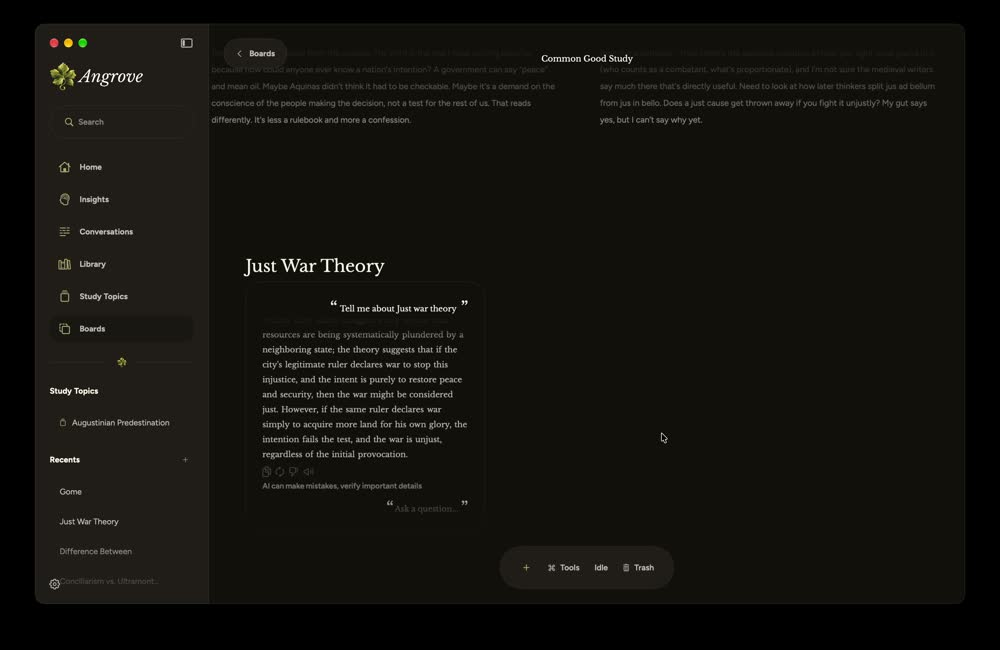
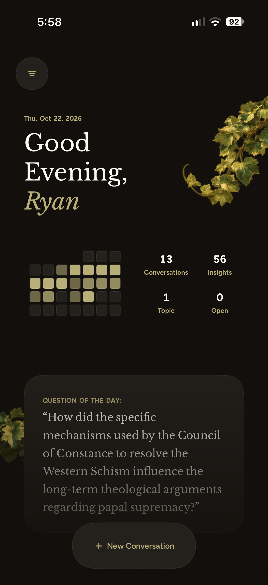
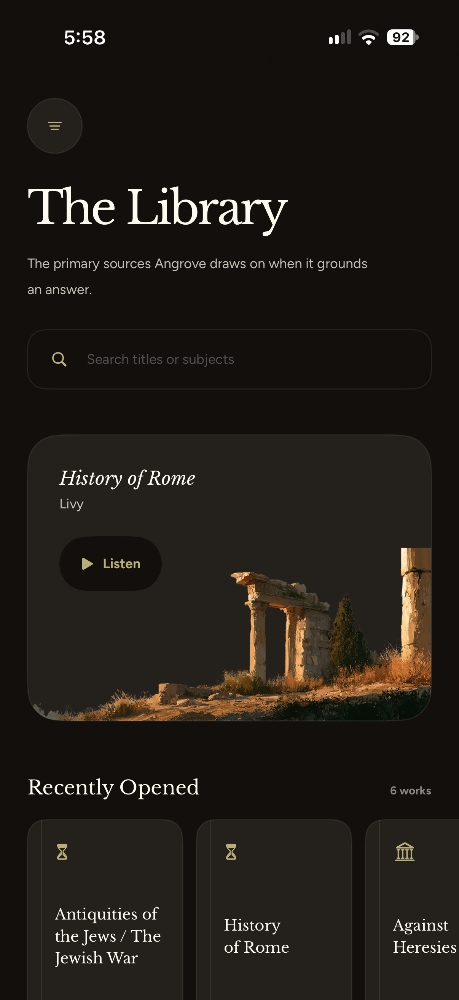
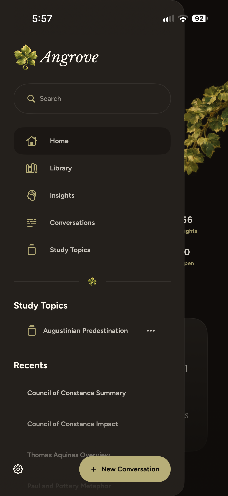
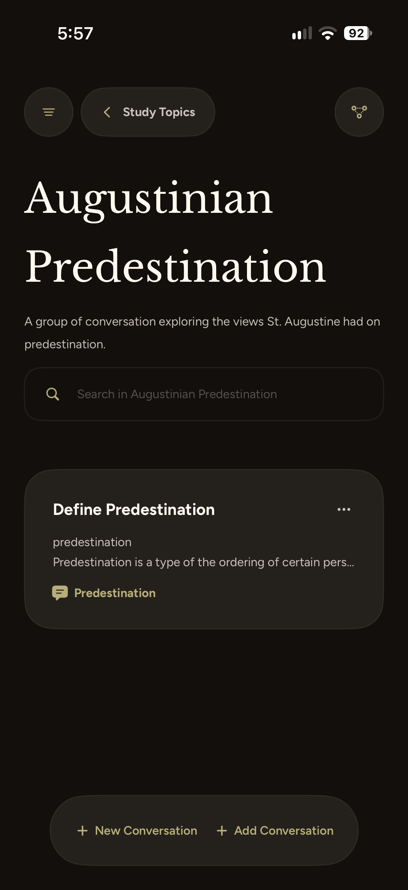

<p align="center">
  <picture>
    <source media="(prefers-color-scheme: dark)" srcset="Documentation/Brand/angrove-app-icon-dark.png">
    
  </picture>
</p>
<p align="center">
  <picture>
    <source media="(prefers-color-scheme: dark)" srcset="Documentation/Brand/angrove-logo-light-text.png">
    
  </picture>
</p>

# Angrove

[](https://github.com/rbaltodano/Angrove-iOS/actions/workflows/ci.yml)

**An AI of your own. A private place for serious questions.**

Angrove is a private study workspace for philosophy, history, and theology. Ask a question,
check the primary sources behind an answer, and save useful ideas in a semantic map.
Generation and retrieval run on-device, without a model server or an account.

Designed and built solo by **Ryan Baltodano**: product design, SwiftUI engineering, model
integration, and the [website](https://angrove.app/). **The iPhone app is in public beta on
[TestFlight](https://testflight.apple.com/join/qHDFeAUa); the native Mac app is in development.**

### Highlights for reviewers

- **On-device LLM.** Gemma 4 E4B runs through LiteRT-LM on iPhone and Mac. No model server, no
  account, works offline.
- **Shared model runtime.** One process-scoped runtime serves answers, definitions, and tree
  updates through a [task queue](Shared/Features/Conversation/ModelTaskQueue.swift) with
  cancellation, reordering, and lifecycle management.
- **Offline grounding.** [Local retrieval](Shared/Services/MiniLMGroundingProvider.swift) over
  51,836 passages from 37 primary works, using Core ML MiniLM embeddings.
- **Encrypted storage.** AES-256-GCM with Keychain-managed keys and in-place
  [plaintext migration](Packages/AngroveCore/Sources/AngroveCore/LocalDataEncryption.swift).
- **Two native apps, one core.** Shared Swift logic with platform-owned navigation, windows, and
  input. 900+ tests across both targets.
- **Measured decisions.** Model defaults are chosen from [recorded evaluations](Documentation/Evaluation.md).

[Portfolio](https://ryanbaltodano.com/) ·
[Watch the 1:49 demo](https://angrove.app/case-study.html#demo-conversation) ·
[Technical case study](Documentation/Case-Study.md) ·
[Try the iPhone beta](https://testflight.apple.com/join/qHDFeAUa) ·
[Build and run](Documentation/Development-Setup.md)

## Watch Angrove in use

Three iPhone app recordings captured October 8, 2026. Select a preview to watch the clip
with playback controls and audio on the website.

| Ask a question and explore its tree · 1:49 | Explore saved ideas · 0:24 | Listen to an answer · 0:50 |
| --- | --- | --- |
| [](https://angrove.app/case-study.html#demo-conversation) | [](https://angrove.app/case-study.html#demo-global-tree) | [](https://angrove.app/case-study.html#demo-reader) |

[All three demos](https://angrove.app/case-study.html#demos) ·
[Conversation guide](https://angrove.app/guide.html#conversation) ·
[Insight Tree guide](https://angrove.app/guide.html#tree)

## A look inside

October 22, 2026 captures from the iPhone app and native Mac app in development.
Select a screenshot to view it at full size.

### On Mac

Boards bring notes, images, saved Insights, and conversations into a spatial study workspace.

<p align="center">
  <a href="Documentation/Screenshots/2026-10-22/mac-boards-1.png"></a>
  <a href="Documentation/Screenshots/2026-10-22/mac-boards-2.png"></a>
  <a href="Documentation/Screenshots/2026-10-22/mac-home-page.png"></a>
  <a href="Documentation/Screenshots/2026-10-22/mac-split-conversation-view.png"></a>
</p>

| Lay your ideas out · 0:12 | Learn easier · 0:17 |
| --- | --- |
| [](Documentation/Screenshots/2026-10-22/lay-your-ideas-out.mp4) | [](Documentation/Screenshots/2026-10-22/learn-easier.mp4) |

Select a preview to open its recording. [Full media set and capture context](Documentation/Screenshots/2026-10-22/README.md).

### On iPhone

<p align="center">
  <a href="Documentation/Screenshots/2026-10-22/ios-homescreen.png"></a>
  <a href="Documentation/Screenshots/2026-10-22/ios-library.png"></a>
  <a href="Documentation/Screenshots/2026-10-22/ios-sidebar.png"></a>
  <a href="Documentation/Screenshots/2026-10-22/ios-study-topics.png"></a>
</p>

<details>
<summary>Earlier captures: conversations, Insight Tree, light appearance, and Study mode</summary>

[October 5 conversation and Insight Tree captures](Documentation/Screenshots/case-study-2026-10-05/README.md).

<p align="center">
  
  
  <a href="Documentation/Screenshots/case-study-2026-10-05/conversation-peloponnesian-war.jpg"></a>
  <a href="Documentation/Screenshots/case-study-2026-10-05/insight-map.jpg"></a>
  <a href="Documentation/Screenshots/study-3d-demo.mp4"></a>
</p>

</details>

## Building the product around the model

One process-scoped LiteRT-LM runtime serves conversation, definitions, and tree updates through
a shared task queue. On-device retrieval supplies source passages, and encrypted persistence
keeps conversations and saved ideas local. Common logic lives in `Shared/`; each platform owns
its navigation, input, and window behavior.

The [technical case study](Documentation/Case-Study.md) explains the constraints and tradeoffs.
These are useful starting points in the implementation:

| Engineering area | Implementation and evidence |
| --- | --- |
| Runtime ownership and cancellation | [Shared task queue](Shared/Features/Conversation/ModelTaskQueue.swift), [iPhone runtime](iOS/Services/AngroveApplicationRuntime.swift), [Mac runtime](macOS/Platform/MacApplicationRuntime.swift) |
| Source-grounded answers | [Local retrieval](Shared/Services/MiniLMGroundingProvider.swift), [retrieval regressions](Angrove-iOSTests/MiniLMGroundingRetrievalTests.swift) |
| Durable conversations and saved ideas | [Shared persistence](Shared/Persistence), [migration regressions](Angrove-iOSTests/EncryptedAttachmentMigrationTests.swift), [architecture](Documentation/App-Architecture.md) |
| Implemented storage encryption | [Coverage and recovery](Documentation/Data-Encryption.md), [AES-GCM and Keychain implementation](Packages/AngroveCore/Sources/AngroveCore/LocalDataEncryption.swift), [encryption regressions](Angrove-iOSTests/PersonalDataEncryptionTests.swift) |
| Mac port in progress | [Mac workspace](macOS/Features/MacWorkspaceView.swift), [navigation history tests](Angrove-macOSTests/MacPageHistoryTests.swift) |
| Measured model tradeoffs | [Evaluation methodology and artifacts](Documentation/Evaluation.md) |

**One measured decision:** native thinking remained off by default after two development sets
returned **74/80 objective passes in either arm**, while simulator median answer time roughly
doubled. These are historical pattern-scored comparisons, not an independent accuracy claim or
phone latency benchmark. See the report for the exact build and limitations.

## From a question to a map of your thinking

- **Conversation:** talk a question through, ask for an example or an objection, and follow up
  for as long as you need.
- **Insights:** tap an underlined term for a definition in the context of your discussion. Save
  the definitions worth keeping; saved definitions become Insights.
- **Insight Tree:** explore how your ideas connect. Angrove adds broader subjects called Node
  Concepts as a conversation develops; Insights are only added when you choose to save them.
  Semantic relatedness shapes the map, so distance reflects meaning rather than truth or importance.
- **Study and Midpoint:** explore a subject and its Insights in 3D, or select and weight ideas
  to propose a concept that connects them.
- **Library:** trace an answer to the passages it draws on and open the source to read it in
  context. The current bundled Library contains **37 works and 51,836 passages**, including
  Scripture, the Church Fathers, Thomas Aquinas, councils, catechisms, classical philosophy,
  and history. Retrieval runs on-device.

Study Topics bring related conversations and their Insights together. Home offers a Question of
the Day and ideas worth revisiting, while Model Tasks lets you stop, remove, or reorder work
waiting for the on-device model.

## A note on privacy and current development

Generation, source retrieval, and Insight Tree work run on-device. Conversations and saved
Insights stay in the app's local storage; answering questions and building the tree make no
network requests. Once the model is installed, Angrove works offline. No account is required.

**Encrypted local storage — implemented on iPhone and Mac.** Angrove encrypts saved personal
data on the device with AES-256-GCM, including conversations, attachments, Insights, Study Topics,
Boards, reading history, personal settings, and local backups. Keys are protected by Apple
Keychain, with separate personal-data keys for each platform and a separate widget key.
User-created conversation exports are readable JSON. Encryption is integrated into storage
and covered by repository tests. Physical-device lock and backup-restore validation is still
pending. See [encryption coverage and recovery](Documentation/Data-Encryption.md).

The current model is **Gemma 4 E4B, instruction-tuned, from the LiteRT Community package**,
running through Google's LiteRT-LM runtime. It is not an Angrove fine-tune. Angrove’s default
Scholarly personality uses the learned-friend prompt; its grounding comes from local retrieval.
A fine-tuned voice model is planned for a later release. On-device MiniLM embeddings support
source retrieval and the semantic relationships in the Insight Tree.

Answers can make mistakes. The Library makes it easy to check important claims against the
author's own words and context.

Angrove is in public beta on [TestFlight](https://testflight.apple.com/join/qHDFeAUa), and the App Store release is next. It is being built to stay
free, with no subscription or paywalled features. Development uses iPhone 17 and Apple silicon
Macs. The Mac front end is still in progress and currently requires macOS 27;
final supported-device requirements and release availability will be shared before launch.
Screenshots, tests, and development evaluations document the work; they are not adoption or
learning-outcome metrics. See the [case study's evidence and open questions](Documentation/Case-Study.md#evidence-and-what-remains-open).
More: [Website](https://angrove.app/) · [User Guide](https://angrove.app/guide.html) ·
[FAQ](https://angrove.app/faq.html).

The local model and grounding assets are large and intentionally excluded from source control.
A clean checkout can build the interface, but full inference requires the development artifacts.
[Setup instructions](Documentation/Development-Setup.md) explain the expected paths, model hash,
degraded behavior and release-delivery gap.

## Repository guide

| Path | What you'll find |
| --- | --- |
| `iOS/` | iPhone app shell, navigation, platform adapters, and iPhone-only features |
| `macOS/` | Native Mac windows, keyboard/mouse interaction, and platform adapters |
| `Shared/Features/` | Conversation, model tasks, Insight Tree, and common presentation |
| `Shared/DesignSystem/` | Semantic typography, colors, motion, and reusable interface elements |
| `Shared/Services/` | Model integration, local retrieval, and shared services |
| `Shared/Persistence/` | Encrypted local storage and durable conversation/Insight state |
| `Angrove-iOSTests/`, `Angrove-macOSTests/` | Behavior and regression coverage for both apps |
| `Documentation/` | Case study, architecture, evaluation evidence, and build instructions |

## Build and verify

Use **Xcode 27 on Apple silicon**. Follow the [setup guide](Documentation/Development-Setup.md),
then open `Angrove-iOS.xcodeproj`. Select **Angrove-iOS** for iPhone or **Angrove-macOS** for Mac.
The deployment targets are iOS 26.4 and macOS 27. A source checkout can build the UI; full
inference requires the separately supplied model and grounding assets.

Use an installed concrete arm64 simulator for iPhone:

```sh
xcodebuild -project Angrove-iOS.xcodeproj -scheme Angrove-iOS \
  -destination 'platform=iOS Simulator,name=iPhone 17,OS=27.0' build
```

Build the native Mac target without a developer signing identity:

```sh
xcodebuild -project Angrove-iOS.xcodeproj -scheme Angrove-macOS \
  -destination 'platform=macOS,arch=arm64' CODE_SIGNING_ALLOWED=NO build
```

The [setup guide](Documentation/Development-Setup.md#verify-behavior) includes test commands for
both platforms. CI runs the asset-independent checks; tests requiring private development
artifacts report explicit skips.

For model-evaluation methodology and recorded evidence, see [Evaluation](Documentation/Evaluation.md).

## For contributors

The app is one part of a three-repository project. The backend repository holds offline tooling
for the grounding corpus, model conversion, and evaluation; the app does not call it at runtime.
The Foundations repository holds the shared product and architecture contracts.

**Backend history.** Earlier development used a Mac-hosted Python/FastAPI service for model
and tree operations. Those contracts were moved on-device, and the app's HTTP clients were
removed to support private, offline use without a running server. The tradeoff is that model
memory, thermal limits, retrieval assets, and lifecycle recovery must fit the person's device.
The Python work remains part of the project's development history and offline toolchain;
it is not a production service required by the current app. See the
[architecture decision](Documentation/Case-Study.md#decisions-and-tradeoffs).

| Repository | Role |
| --- | --- |
| [Angrove Backend](https://github.com/rbaltodano/Angrove-Backend) | Corpus tooling, model conversion, and evaluation. Its FastAPI service is no longer used by the app. |
| [Angrove Foundations](https://github.com/rbaltodano/Angrove-Foundations) | Shared product, design, model-integration, and Insight Tree documentation. |

Before contributing, read [`AGENTS.md`](AGENTS.md). It routes implementation work to the focused
architecture, runtime, workflow, and cross-repository documents without making the README carry
internal development detail.

## Naming

Angrove was originally named Aquinas. Bundle identifiers, stored-data keys, and some local paths
keep that name so existing installs and tooling continue to work; references to Thomas Aquinas
are to the theologian.

## License

Copyright © 2026 Ryan Baltodano (Sine Viridian). All rights reserved. The source is published
for reference and review; see [`LICENSE`](LICENSE). Third-party components keep their own
licenses.
